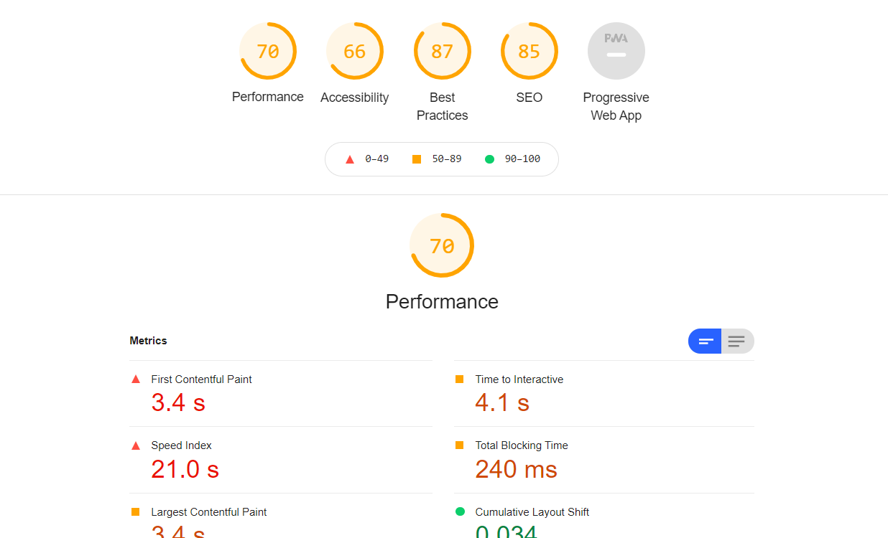
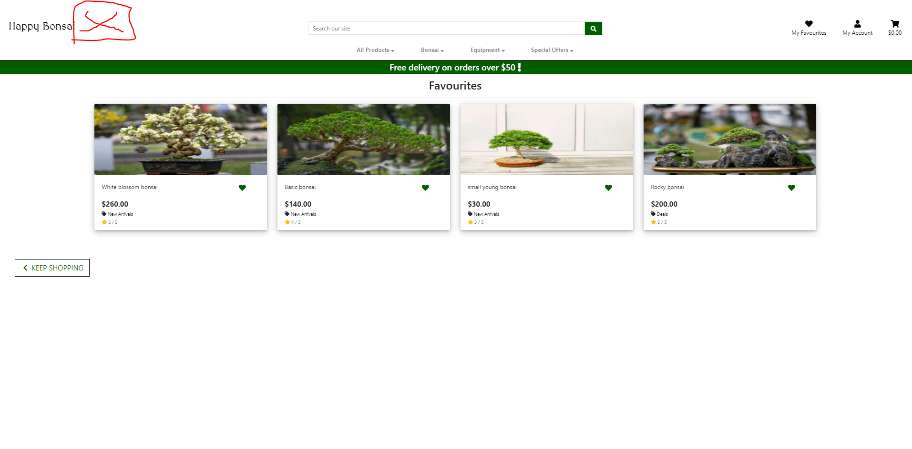

# Happy Bonsai - Testing details

[Main README.md file](README.md)

View the live website here. [link](https://happy-bonsai.herokuapp.com/)

## Table of Contents

1. [Automated Testing](#automated-testing)
    - [Validation services](#validation-services)
    - [Python Testing](#python-testing)
2. [User Stories Testing](#user-stories-testing)
3. [Manual Testing](#manual-testing)
4. [Bugs discovered](#bugs-discovered)
    - [Solved bugs](#solved-bugs)
    - [Unsolved bugs](#unsolved-bugs)
5. [Further Testing](#further-testing)

## Automated Testing
### Validation services

### HTML Validation

-   [W3C Markup Validator](https://validator.w3.org/)
All pages were checked using the W3C markup validator. Most pages were checked via URL. However, 
for the profile page you have to be logged in, so this page was checked by copying the code into the validator.
1 duplicated id error was found however this is between the main nav and the mobile nav so these should not be at the same page normally.

### CSS Validation

- [W3C CSS Validator](https://jigsaw.w3.org/css-validator/#validate_by_input)
The base css was tested by file input and no errors were found.

### JS Validation

- [jshint javascript validator](https://jshint.com/)
javascript was tested and no errors were found

###  Python Validation

- [PEP8 online](http://pep8online.com/checkresult)
All the main pages were tested with pep8online. most of the errors were removed.

### Lighthouse
 while using lighthouse the website got these results:

### Python Testing

Due to time constrains and still learning how to write python in django I was sadly not able to write test for the python.

## User Stories Testing

1. As a site user I want to be able to View list of purchasable products.
    - When arriving on the site you can see the first products already after that you can go to the products tab and see all the products.

2. As a site user I want to be able to View details of products.
    - when clicking on a product in home, favourites or products you will redirected to the product detail page.

3. As a site user I want to be able to Quickly find deals and special offers.
    - On the nav bar you can see a dropdown menu with special offers.

4. As a site user I want to be able to See the total of my purchases while shopping.
    - On the navbar you can see the total cost of your bag.

5. As a site user I want to be able to Quickly and easily register. 
    - On the navbar you can see the My account button where you can register

6. As a site user I want to be able to Quickly login in and out.
    - On the navbar you can see the My account button where you can login/out.

7. As a site user I want to be able to Easily Recover password.
    - When trying to log in there is a button Forgot you password that you can click to get a mail to set a new password

8. As a site user I want to be able to See a Record of bought products.
    - When logged in you can see your order history on your profile page

9. As a site user I want to be able to Sort list of items.
    -  On the product page you can sort by price, rating, name or category

10. As a site user I want to be able to  Sort specific items.
    -  On the product page you can sort by price, rating, name or category

11. As a site user I want to be able to Search by name or description.
    - in the main nav bar there is a search field that searches products by name and description.

12. As a site user I want to be able to Get a good display what I have searched.
    - When searching you get the amount of products that match your query and the products will be in nice product cards that are responsive.

13. As a site user I want to be able to Being able to make a list of items that i like.
    - When logged in you can click on the green favourite buttons to add or remove products from your favourites page.

14. As a site user I want to be able to View items in my cart.
    - When clicking the cart icon in the navbar you will see all the items in your bag.

15. As a site user I want to be able to Adjust my bag.
    - When you click the cart icon you go to the bag page there you can add to the quantity remove a certain amount or remove products completely.

16. As a site user I want to be able to  Enter my payment info.
    - After you went to the bag page you can go to the secure checkout where you can fill in your payment info

17. As a site user I want to be able to Safely and securely use personal payment info.
    - the payment is set-up with stripe and is secured

18. As a Admin I want to be able to add update and delete products in the store.
    - when logged in as a superuser/staff you can delete or edit products from the detail page. You can add products from product management page which can be found under my account. These actions can also be done from the admin page.

19. As a Admin I want to be able to Add categories.
    - This can be done from the admin page. by adding /admin to the homepage and then login in as a super user you will be able to add categories under the products tab.

20. As a Admin I want to be able to manage orders.
    - This can be done from the admin page. by adding /admin to the homepage and then login in as a super user you will be able to see all the orders under the checkout tab.

21. As a Admin I want to be able to manage profiles and reviews.
    - - This can be done from the admin page. by adding /admin to the homepage and then login in as a super user you will be able to see all reviews and profiles under the rating tab.

## Manual Testing
- The website was tested on Google Chrome and on Edge. 
- The website was tested with all the pages for the responsiveness on phone iPad and computer and also on devtools in chrome for the same things.

## Bugs discovered
### Solved bugs
- When using the link forgot password  some users got no email send. *fixed*
- When searching for seeds via the category on the navbar seeds products are not shown *fixed*

### Unsolved bugs
- When removing or adding a favourite you are not returned to the same spot on the website.
- When registering with a @live mail sometimes the conformation mail will not get trough.
- tilt.js doesnt seem to be working.
- on certain parts of the site the logo icon doesnt seem to load 

## Further Testing

- The website was tested by several people on different devices to see if the links and functions were working.
and for illogical paths functions et cetera.

