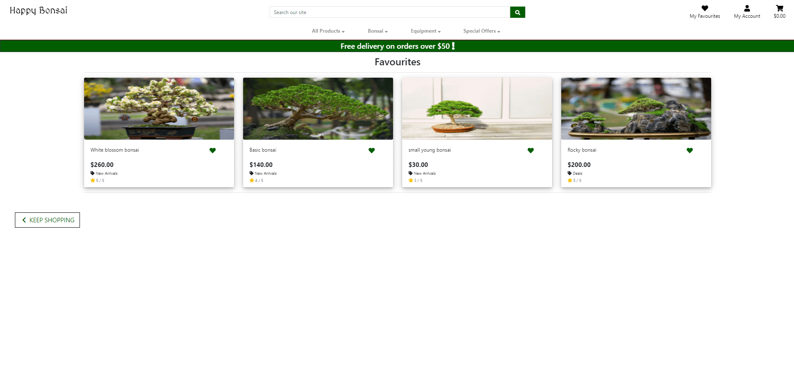

# Happy Bonsai

View the live website here. [link](https://happy-bonsai.herokuapp.com/)

Happy Bonsai was designed, built and deployed by Paul Dijxhoorn as his final project to achieve his full-stack development diploma of Code institute. The purpose of this website is to show the acquired skills of Paul during this course. This website is designed to give users a smooth and effortless shopping experience. Specifically aimed at customers who enjoy the beauty of nature and tranquility. The website is not designed with a particular device in mind and will work well on phone tablet and pc.


## Table of contents
1. [UX](#ux)
    - 1.1 [Goals](#goals)
        - 1.1.1 [Visitor Goals](#visitor-goals)
        - 1.1.2 [Business Goals](#business-goals)
    - 1.2 [User Stories](#user-stories)
    - 1.3 [Design Choices](#design-choices)
        - 1.3.1 [Color scheme](#color-sheme)
        - 1.3.2 [Typography](#Typography)
        - 1.3.3 [Imagery](#Imagery)
    - 1.4 [Wireframes](#wireframes)

2. [Features](#features)
    - [Existing Features](#existing-features)
        - [Elements on every Page](#elements-on-every-page)
        - [Home Page](#home-page)
        - [Shop Page](#ashop-page)
        - [Listing Detail Page](#listing-detail-page)
        - [About Page](#about-page)
        - [Frequently Asked Questions Page](#frequently-asked-questions-page)
        - [Contact Page](#contact-page)
        - [Register Page](#register-page)
        - [Login and out Pages](#Login-and-logout-Pages)
        - [Account Page](#account-page)
        - [bag Page](#bag-page)
        - [Checkout](#checkout)
    - [future features](#future-features)

3. [Information Architecture](#information-architecture)
    - [Database choice](#database-choice)
    - [Data Models](#data-models)
        - [User](#user)
        - [Products App Model](#products-app-model)
        - [Checkout App Models](#checkout-models)
        - [User profile model](#user-profile-model)
        - [Rating model](#rating-model)

4. [Technologies Used](#technologies-used)
    - [Tools](#tools)
    - [Frameworks](#Frameworks)
    - [Databases](#databases)
    - [Libraries](#libraries)
    - [Languages](#languages)

5. [Testing](#testing)
    - See separate [TESTING.md](TESTING.md) file.
    

6. [Deployment](#deployment)
    - [How to run this project locally](#how-to-run-this-project-locally)
    - [Heroku Deployment](#heroku-deployment)

7. [Credits](#credits)
    - [Content](#content)
    - [Images](#images)
    - [Code](#code)
    - [Acknowledgements](#acknowledgements)
    - [disclaimer](#disclaimer)
    - [reflection](#reflection)

8. [Contact](#contact)


##  UX
### Goals
#### Visitor Goals 

The central target audience for Happy Bonsai are:
- People who enjoy nature.
- People who have interest for japanese culture.
- People who are searching for a unique gift.
- People who are looking for beautiful in or outdoor  plants 

Users goals are:
- Find a unique gift  
- Enjoy looking at all the beautiful bonsai
- Easily navigate the site
- Buy from a trustworthy site


The Happy Bonsai webshop is a amazing way to meet these needs because: 
- The products can be found easily by category, price, rating, name. by using the text search products can be found by name and description making it easy to find specific products. 
- The lay out and navigation of Happy Bonsai are build upon the conventions of well laid out shops.  
- The products have clear photo's and the information about the products is easy to find.

#### Business Goals
The Happy Bonsai business goals are:
- To give of a professional, trustworthy and safe feeling to users so that they can buy products without doubt.
- To make sales easy for buyers to boost sales.
- to keep track of sales data to see popularity of products.

### User Stories

- Viewing and Navigation

| AS A    | I WANT TO BE ABLE TO ... | SO THAT I CAN... |
| ----------- | ----------- | ----------- |
| Site User |   View list of purchasable products           |      See what choices i have       |
| Site User |   View details of products                    |      see if the products are what I am looking for       |
| Site User |   Quickly find deals and special offers       |      Get all the best deals       |
| Site User |   See the total of my purchases while shopping|     Cant get surprised of the cost       |
<br/>
- Registration and User Accounts

| AS A    | I WANT TO BE ABLE TO ... | SO THAT I CAN... |
| ----------- | ----------- | ----------- |
| Site User |    Quickly and easily register        |      use all the extra functionality       |
| Site User |    Quickly login in and out           |      use all the functions i want and close my account       |
| Site User |    Easily Recover password            |      recover my password when lost       |
| Site User |    See a Record of bought products    |      see the cost and products I ordered       |
<br/>

- Sorting and searching

| AS A    | I WANT TO BE ABLE TO ... | SO THAT I CAN... |
| ----------- | ----------- | ----------- |
| Site User |    Sort list of items                      |      See the specific product I am looking for quicker       |
| Site User |   Sort specific items                      |        See the specific product I am looking for quicker     |
| Site User |   Sort categories                          |      See the specific product I am looking for quicker       |
| Site User |   Search by name or description            |      See the specific product I am looking for quicker       |
| Site User |   Get a good display what I have searched  |      See the specific product I am looking for quicker       |
| Site User | Being able to make a list of items that i like (favourites)|      buy products on a later moment and i dont have to look for them.       |
<br/>

- Shopping cart, Purchasing and Checkout

| AS A    | I WANT TO BE ABLE TO ... | SO THAT I CAN... |
| ----------- | ----------- | ----------- |
| Site User |    View items in my cart          |      See that my order is right and i can see the prices       |
| Site User |   Adjust my bag         |      Adjust when i am not happy with the current bag       |
| Site User |    Enter my payment info  |      Pay and get my products       |
| Site User |   Safely and securely use personal payment info      |      So i will not be stolen from or hacked       |
<br/>
- Admin

| AS A    | I WANT TO BE ABLE TO ... | SO THAT I CAN... |
| ----------- | ----------- | ----------- |
| Admin |    add update and delete products in the store            |      Change and evolve my store       |
| Admin |    Add categories                                         |       Expand products sold       |
| Admin |    manage orders                                          |       Know products to send and where      |
| Admin |    manage profiles and reviews                            |      Help my customers when the lose account info       |
<br/>

### Design Choices

buttons grow on hover over to signify the growth of the bonsai.

#### color scheme

During this project i used green, brown, black, and white. Green and brown are natural colors. This is good for a website for bonsai trees. brown is associated with earth and green is often associated with leafs. White is used for the background for its neutral and clean. The color codes used can be seen in the image below. 

The color test:


The color test was done [here](https://contrastchecker.com/)

#### Typography
        
MedievalSharp was used for the logo text to give it a eastern look. the place where bonsai came from are china though japan popularized it. The font reminds me of the japanse pagoda's. 


Roboto was used for all the regular text because this is a very readable and clean font.


#### imagery

### Wireframes


## Features

### Elements on every Page

- The navigation bar  is responsive for phone and ipad users. When seen on the phone or ipad it shows a hamburger menu with all the same options as on a computer. The buttons are interactive for computer. When hovered over the links show conformation by slightly growing.
- On all the devices you can see and use the search function on whatever page you are.


### Home Page
-   The Home page has the 4 newest products displayed for users that come more frequently.
-   Beneath that there is a call to action/ shop button


### Products Page
-   The product page has all the products. which can be sorted in several ways.(price,rating,name or category)
-   The product cards link to detail pages which give more detailed info about the products. the cards are kept small so you can oversee as much products as possible.
-   When logged in you can see green favourites buttons you can toggel these to add the product to your favourites list.


### product Detail Page
-   The product detail page displays just one product but now the image is bigger and a description is visible.
-   underneath the description there is a input and 2 buttons to specify how many of the product you want to add. Beneath that there is a button to keep shopping or to add the product to your bag.
- Under the image there is a review/ rating field where you can see the reviews/ ratings or add them. If you are not logged in you will be send to login first.
- in the top you can see a favourites button again


### favourites page
- This page displays all the products you added to your wishlist/ favourites. When clicking the green favourite button you remove that product from your favourites.
- When clicking on one of the products you will be send to the product_detail page of that product.




### Register Page
- The register page has a form to register. after you will be asked to confirm your account via mail.


### Login and logout Pages
- The login page has a form to log in after being logged in you will be redirected to the home screen. There are some screens to require a user to be logged in. If they then log in thew will be redirected there. After login out you will be directed to the home screen as well.


### Profile Page
- On the profile page you can see your order history and personal details which you can update in the same screen.
- When you click on an order you get to see all the details of that order again


### bag Page
- The bag page has all the products added to the bag displayed with the option to adjust the amount or remove the product entirely.
- Underneath buttons to keep shopping or go to the checkout.


### Checkout
- On the checkout page you can see a summary of your order. And a form for all the personal details if you are logged in it will auto fill all the details already given in your profile.


- After buying your products you will get a conformation with the order numbers and all the other important information.


### future features
- See the amount of favourites that you have in the favourites icon at the top nav bar.
- If there are no reviews there should be text saying: write the first review.
- Connect the individual review score to the product rating
- See the amount of reviews a product has. and if there are a lot then a hide/show function so the page will not get to big.    

## Information Architecture

### Database choice
- Django uses SQL databases for its framework. For deployment I used the database provided by heroku which is a PostgresSQL database.
-   The database used during development locally was sqlite3 within django. 


### Data Models
#### User

    django.contrib.auth.models was the model that is used for the user.

#### Products App Model

- Within the products app there are 2 models the category model and the products model

**category model**

| Name | Key in db | Validation | Field Type |
--- | --- | --- | ---
Name | name      |    max_length=254    | CharField
Friendly_name| friendly_name| max_length=254, null=True, blank=True| CharField|

**Product model**
| Name | Key in db | Validation | Field Type |
--- | --- | --- | ---
Category | category      |'Category', null=True, blank=True, on_delete=models.SET_NULL| ForeignKey from categories
Sku| sku | max_length=254, null=True, blank=True| CharField|
Name|name |max_length=254 |CharField |
Description|description | | TextField|
Price| price| max_digits=6, decimal_places=2| DecimalField|
Score| score | default=5, validators=[MaxValueValidator(5), MinValueValidator(1)]| IntegerField|
Image_url|image_url |max_length=1024, null=True, blank=True |URLField |
Image |image  | null=True, blank=True| ImageField|
Favourites|favourites |User, related_name='favourite', default=None, blank=True |ManyToManyField |


#### Checkout Models

**Order**
| Name | Key in db | Validation | Field Type |
--- | --- | --- | ---
order_number|order_number| max_length=32, null=False, editable=False|CharField|
User_profile| user_profile| UserProfile, on_delete=models.SET_NULL, null=True, blank=True, related_name='orders'|ForeignKey to user profile|
Full_name| full_name| max_length=50, null=False, blank=False|CharField|
Email| email| max_length=254, null=False, blank=False|EmailField|
Phone_number|phone_number|max_length=20, null=False, blank=False|CharField|
country|country|blank_label='Country *', null=False, blank=False|CountryField|
Postcode| postcode|max_length=20, null=True, blank=True|CharField|
Town_or_city| town_or_city|max_length=40, null=False, blank=False|CharField|
Street_address1|street_address1|max_length=80, null=False, blank=False|CharField|
Street_address2|street_address2|max_length=80, null=False, blank=True|CharField|
County| county|max_length=80, null=True, blank=True|CharField|
Date| date|auto_now_add=True|DateTimeField|
Delivery_cost| delivery_cost|max_digits=6, decimal_places=2, null=False, default=0|DecimalField|
Order_total|order_total|max_digits=10, decimal_places=2, null=False, default=0|DecimalField|
Grand_total| grand_total|max_digits=10, decimal_places=2, null=False, default=0|DecimalField|
Original_bag|original_bag|null=False, blank=False, default=''|TextField|
Stripe_pid| stripe_pid| max_length=254, null=False, blank=False, default=''|CharField|


**OrderLineItem**
| Name | Key in db | Validation | Field Type |
--- | --- | --- | ---
Order|order |null=False, blank=False, on_delete=models.CASCADE, related_name='lineitems'|ForeignKey to order|
Product|product|Product, null=False, blank=False, on_delete=models.CASCADE|ForeignKey to product|
quantity|quantity|null=False, blank=False, default=0|IntegerField|
lineitem_total| lineitem_total|max_digits=6, decimal_places=2, null=False, blank=False, editable=False|DecimalField|


#### User profile model
| Name | Key in db | Validation | Field Type |
--- | --- | --- | ---
User| user|User, on_delete=models.CASCADE|OneToOneField|
default_phone_number|default_phone_number| max_length=20, null=True, blank=True|CharField|Default_street_address1|   default_street_address1| max_length=80, null=True, blank=True|CharField|Default_street_address2|   default_street_address2|max_length=80, null=True, blank=True|CharField|
Default_town_or_city|default_town_or_city|max_length=40, null=True, blank=True|CharField|
Default_county| default_county|max_length=80, null=True, blank=True|CharField|
Default_postcode | default_postcode | max_length=20, null=True, blank=True|CharField|
Default_country|default_country|blank_label='Country', null=True, blank=True|CountryField|


#### Rating model
| Name | Key in db | Validation | Field Type |
--- | --- | --- | ---
Product|  product|  Product, null=False, blank=False, on_delete=models.CASCADE|ForeignKey from product|
User|user| User, null=False, blank=False, on_delete=models.CASCADE|ForeignKey from user|
Title|title|max_length=254, null=True, blank=True|.CharField|
Rating|rating|default=5, validators=[MaxValueValidator(5),
                MinValueValidator(1)|IntegerField|
Review| review||TextField|


## Technologies Used
### Tools
 - Git/github to handle version control and store my code.
 - Gitpod was used as my IDE
 - PIP for installing tools needed in the project
 - Code spell checker 
 - django crispy forms for the styling of the django forms
 - gunicorn to aid the development of the heroku deployment
 - pillow for processing image files to the database
 - psycog2 for adaptor of PostgreSQL  
 - Stripe for the payment system
 - boto3 the managment of AWS S3
- AWS S3 bucket to store the images from the database


### framework
### Databases
Database used are:
- Heroku postgres
- SQlite3
### Libraries
The libraries used where:
- bootstrap
- jquery
- fontawesome
- google fonts
- ionicons

### Languages 
The  languages used are :
-   HTML5
-   CSS3
-   Javascript
-   Python

## Testing
- See separate [TESTING.md](TESTING.md) file.

## Deployment

### How to run this project locally


1. make sure you have a IDE to work from where you have PIP Python3 and Git installed.
2. make accounts to Stripe, AWS, and set up a S3 bucket
3. Sign in to github and go the main page of this repository [link](https://github.com/pjdijxhoorn/milestone-4-webshop).
4. Above the files click the button for Code.
5. Copy the link under the HTTPS tab.
6. open your code editor.
7. Open a new work directory, or an existing one where you want the directory to be created.
8. In the command line write git clone, and after that paste the URL you from Step 5 and hit enter.

        git clone https://https://github.com/pjdijxhoorn/milestone-4-webshop

9. Install all the needed modules with  

        pip -r requirements.txt.

10. Set up environment variable in your selected IDE, or you can create .env file in your root directory and add .env to .gitignore file, and add the followings to the .env file.

        import os  
        os.environ["DEVELOPMENT"] = "True"    
        os.environ["SECRET_KEY"] = "<Your Secret Key>"
        os.environ["STRIPE_PUBLIC_KEY"] = "<Your Stripe Public Key>"    
        os.environ["STRIPE_SECRET_KEY"] = "<Your Stripe Secret Key>"    
        os.environ["STRIPE_WH_SECRET"] = "<Your Stripe WH Secret Key>"    

11. Migrate the models to create  your database template with the following commands in the terminal.

        python3 manage.py makemigrations

         python3 manage.py migrate


12. load the data fixtures with the command

        python3 manage.py loaddata <fixture_name>


13. Create a superuser to acces the django admin panel and database. After that follow the steps for username, password and email. 

        python3 manage.py createsuperuser

14. Run your program locally with this command.

        python3 manage.py runserver

15. Once the program is running, go to the local link provided and add /admin to the end of the url. Here log in with your superuser account and create instances category, products, rating after this the website should run as expected


### Heroku Deployment

To deploy this website/ app to Heroku use the next steps:

1. Create a `requirements.txt ` in your terminal by the command `pip freeze > requirements.txt`.
2. create a `procfile` with the terminal command `echo web: python app.py > Procfile`.
3. Add commit and push with the following commands
```
git add -A
```
```
git commit -m " "
```
```
git push
```
4. Sign up or log in to your account on Heroku.
5. Create a new app with a unused name.
6. Set the region to be the closest one to you.
7. When you created the app go to the 'Settings' tab and click 'Reveal Config Variables' and input the following values.

| Key | Value |
--- | ---
AWS_ACCESS_KEY_ID | `<your secret key>`
AWS_SECRET_ACCESS_KEY | `<your secret key>`
DATABASE_URL | `<your postgres database url>`
EMAIL_HOST_PASS | `<your secret key>`
EMAIL_HOST_USER | `<your heroku app hostname>`
STRIPE_PUBLIC_KEY | `<your secret key>`
STRIPE_SCRET_KEY | `<stripe secret key>`
STRIPE_WH_KEY | `<Stripe wh secret key>`
USE_AWS | `<True>`

Note: I replaced several values with a placeholder for security reasons.

8. From the command line of your local IDE:
    - Enter the heroku postres shell 
    - Migrate the database models 
    - Create your superuser account in your new database

9. In your heroku dashboard, click "Deploy". Scroll down to "Manual Deploy", select the master branch then click "Deploy Branch".


10. Scroll down to the deploy button and click
'enable automatic deployment'.

11. Click view app and enjoy your project.

12. From the link provided add `/admin` to the end of the url, log in with your superuser account and create a rating of a product within the new database.


## Credits
### Content
- All the content was written by myself except from ratings and reviews which can be written by anyone and the ones populating the website are from family and friends.
### Images
- All the images not from myself have the name and site in their title. All these images  were free to use and where from these websites: 
    -   https://www.pexels.com/nl-nl/
    -   https://unsplash.com/
    -   https://www.stockvault.net/
    -   https://pixabay.com/
    -   https://picjumbo.com/
    -   https://www.freeimages.com/nl/
    -   https://pikwizard.com/
    -   https://stocksnap.io/
    -   https://www.rawpixel.com/

### Code
- Due the fact that I didn't have a lot of time for this last project and my confidence in my django skills where not high I based most of my code on the mini project Boutique Ado. Except for the two apps favourites and ratings.
- when working on the rating app I got some solutions from the project of fatima from student support from her project spice ur look
- For the code of the favourites app I used some solutions from https://www.youtube.com/watch?v=H4QPHLmsZMU learn django from the youtube channel Very Academy.

### Acknowledgements
I would like to thank: 
- My current mentor Sandeep Aggarwal for his support and help with the project.
- The people of student support for all their help and in particular Johann. He really helped me a lot In the second to last day when I was completely stressed out and didn't think I was able to reach the deadline anymore
- My partner and parents for their support during the complete course.
- My mentor for the first 3 projects Anna Villanueva she was really inspiring and went above and beyond to help me grow.


### disclaimer

-   This website is created for educational purpose only. 
the content of the website is entirely fictional. 


### reflection

-   I really love coding however I sadly couldn't enjoy this project as much as I would have like due to time constrains.
My main focus was getting all the functions to work which took up way more time the anticipated.
Because of that I couldn't really style the website or add all the features that I would have liked. This led that was constantly trying to rush to get everything rolled out and making way more rash decisions that cost me more time on the long run and made the project sloppier then it had to be. 

-   The favourites function is set up in a bad way. It should have been in its own model now. Because of this the site is more clunky and when adding products on the site or via the admin you get a favourites input with every product.

-   After completing this project if released that i still have a lot to learn and that the speed of my coding is still to slow.
This mainly due my lack of knowledge of the working of django and the correct syntax of code. After I am done with this project I will be starting some projects of my own to hone my skills. 


## Contact

feel free to contact me at pjdijxhoorn(at)hotmail(dot)com
